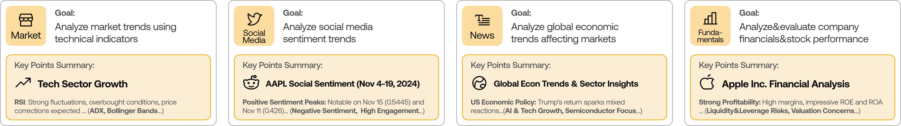
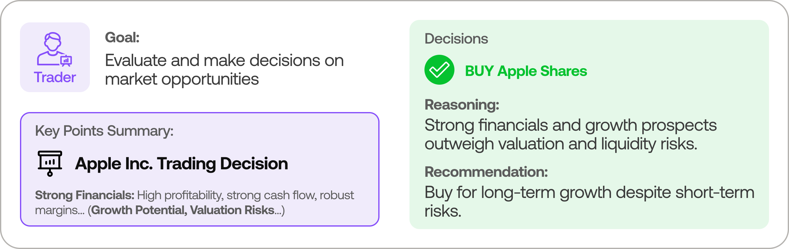
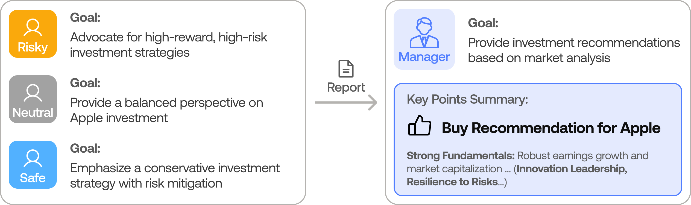
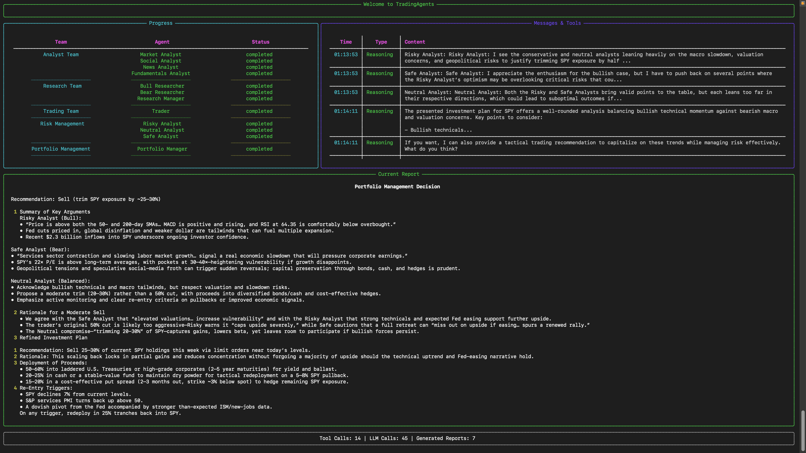

<div align="center">

# 📈 TradingAgents

### Multi-Agent LLM Financial Trading & Market Analysis Framework

[](https://python.org)
[](https://fastapi.tiangolo.com)
[](https://github.com/langchain-ai/langgraph)
[](LICENSE)

<br>

🚀 [Framework Architecture](#tradingagents-framework) | 🖥️ [Web Dashboard](#web-dashboard) | ⚡ [Installation & CLI](#installation-and-cli) | 📦 [Python Usage](#tradingagents-package) | 🔄 [Persistence](#persistence-and-recovery)

</div>

---

# TradingAgents: Multi-Agents LLM Financial Trading Framework

## Verified current branch status

The current workspace was verified with the repository's supported Windows virtual environment:

```powershell
D:\TradingAgents\.venv\Scripts\python.exe -m pytest -q -m "not e2e"
```

Result on 2026-09-30: `2096 passed, 5 skipped, 5 deselected, 0 failed, 20 warnings,
88 subtests passed`. Local Chromium E2E also passed (`5 passed`). GitHub Actions
run [36664347641](https://github.com/Zubair815/TradingAgents/actions/runs/36664347641)
is green for base commit `53bdf53160d70dd6797c73d96b166cbba00a0185`
(`Version1.7`) on Python 3.10, 3.11, 3.12, and 3.13, including Ruff,
clean-install, and Chromium E2E jobs. The final working-tree polish is uncommitted,
so its GitHub CI remains pending until commit and push.

Release status: **READY FOR LOCAL DEMO VALIDATION**. Automated engineering gates
pass, but the Windows + XM Demo checklist has not been executed. This status is
not a trading-performance recommendation.

## Forex decision-support safety

The Forex platform produces `LONG`, `SHORT`, or `NO_TRADE` decision support and
a deterministic risk/sizing result. The user alone decides whether to act and
places, modifies, partially closes, or closes any order manually in MT5.
TradingAgents' MT5 integration is read-only: it observes account state,
positions, orders, deals, and manual changes for reconciliation and learning. It
contains no automated broker-order submission path.

Historical agent backtests, walk-forward reports, and ablation comparisons are
descriptive and retain `validated_strategy_performance=false`. They are not proof
of profitable or statistically validated trading performance. See
[FINAL_REPORT.md](FINAL_REPORT.md) for the feature matrix and evidence, and
[the XM Demo checklist](docs/XM_MT5_DEMO_ACCEPTANCE.md) for the remaining manual
acceptance gate.

## News
- [2026-09] **Interactive Web Dashboard**: Added a modern browser-based UI and FastAPI backend with real-time SSE progress streaming across all 13 pipeline nodes, interactive multi-section reports, secure browser session auth with optional API key protection, and unified history deduplication.
- [2026-09] **TradingAgents v0.5.0** released with point-in-time integrity across every dated path, SEC EDGAR fundamentals served as filed, backtesting over a ticker and date grid, portfolio-aware runs, and current model lineups across every provider. See [CHANGELOG.md](CHANGELOG.md) for the full list.
- [2026-08] **TradingAgents v0.4.0** released with look-ahead / point-in-time fixes across FRED macro, social sentiment, and the decision-log memory; clearer decision signals; working CLI checkpoint resume; Trader price grounding; and the GPT-5.6 and GLM-5.3 models.
- [2026-07] **TradingAgents v0.3.1** released with correctness and stability fixes: Alpha Vantage look-ahead filtering, graph-router crash-safety, graph-shape-aware checkpoint resume, working crypto sentiment sources, a configurable LLM retry budget, Bedrock API-key auth, and Claude Sonnet 5 / Fable 5 support.

<details>
<summary>Earlier releases</summary>

- [2026-06] **TradingAgents v0.3.0** released with a verified data-access contract, an expanded provider registry (NVIDIA, Kimi, Groq, Mistral, Bedrock, and any OpenAI-compatible endpoint), FRED and Polymarket data vendors, a current-generation model catalog, and a CI gate.
- [2026-05] **TradingAgents v0.2.5** released with the grounded Sentiment Analyst, GPT-5.5 etc. model coverage, Qwen/GLM/MiniMax dual-region support, `TRADINGAGENTS_*` env-var configurability with API-key auto-detection, remote Ollama support, non-US alpha benchmarks, and ticker path-traversal hardening.
- [2026-04] **TradingAgents v0.2.4** released with structured-output agents (Research Manager, Trader, Portfolio Manager), LangGraph checkpoint resume, persistent decision log, DeepSeek/Qwen/GLM/Azure provider support, Docker, and a Windows UTF-8 encoding fix.
- [2026-03] **TradingAgents v0.2.3** released with multi-language support, GPT-5.4 family models, unified model catalog, backtesting date fidelity, and proxy support.
- [2026-03] **TradingAgents v0.2.2** released with GPT-5.4/Gemini 3.1/Claude 4.6 model coverage, five-tier rating scale, OpenAI Responses API, Anthropic effort control, and cross-platform stability.
- [2026-02] **TradingAgents v0.2.0** released with multi-provider LLM support (GPT-5.x, Gemini 3.x, Claude 4.x, Grok 4.x) and improved system architecture.

</details>

## TradingAgents Framework

TradingAgents is a multi-agent trading framework that mirrors the dynamics of real-world trading firms. By deploying specialized LLM-powered agents: from fundamental analysts, sentiment experts, and technical analysts, to trader, risk management team, the platform collaboratively evaluates market conditions and informs trading decisions. Moreover, these agents engage in dynamic discussions to pinpoint the optimal strategy.

<p align="center">
  
</p>

> **Disclaimer**: TradingAgents framework is designed for research purposes. Trading performance may vary based on many factors, including the chosen backbone language models, model temperature, trading periods, the quality of data, and other non-deterministic factors. It is not intended as financial, investment, or trading advice.

Our framework decomposes complex trading tasks into specialized roles.

### Analyst Team
- Fundamentals Analyst: Evaluates company financials and performance metrics, identifying intrinsic values and potential red flags.
- Sentiment Analyst: Aggregates news headlines, StockTwits, and Reddit chatter into a single sentiment read to gauge short-term market mood.
- News Analyst: Monitors global news and macroeconomic indicators, interpreting the impact of events on market conditions.
- Technical Analyst: Utilizes technical indicators (like MACD and RSI) to detect trading patterns and forecast price movements.

<p align="center">
  
</p>

### Researcher Team
- Comprises both bullish and bearish researchers who critically assess the insights provided by the Analyst Team. Through structured debates, they balance potential gains against inherent risks.

<p align="center">
  
</p>

### Trader Agent
- Composes reports from the analysts and researchers to make informed trading decisions, determining the timing and magnitude of trades.

<p align="center">
  
</p>

### Risk Management and Portfolio Manager
- Continuously evaluates portfolio risk by assessing market volatility, liquidity, and other risk factors. The risk management team evaluates and adjusts trading strategies, providing assessment reports to the Portfolio Manager for final decision.
- The Portfolio Manager approves/rejects the generic research proposal. Generic
  simulations may model execution; the Forex platform never submits a broker
  order and requires the user to execute manually.

<p align="center">
  
</p>

## Web Dashboard

TradingAgents features an interactive web dashboard providing a user-friendly interface to configure parameters, trigger agent analyses, observe live multi-agent execution steps in real-time, and inspect rich reports.

### Key Capabilities
- **Real-Time Pipeline Tracking**: Live progress indicators and node status updates streamed via Server-Sent Events (SSE) across all 13 pipeline nodes (Market, Sentiment, News, Fundamentals Analysts, Bull & Bear Researchers, Research Manager, Trader, Risk Debaters, and Portfolio Manager).
- **Interactive Multi-Section Reports**: Collapsible markdown viewers for Analyst Team Reports, Investment Debate, Trader Plan, Risk Management Debate, and Final Decision.
- **Run History & Deduplication**: View past analyses and persisted reports from disk with automatic deduplication between active and saved runs.
- **Accurate Analysis Date Persistence**: Historical trade dates are persisted directly in report headers and accurately displayed across server restarts.
- **Access Control**: Built-in session authentication via secure cookies for local browser usage, with optional API key enforcement (`TRADINGAGENTS_DASHBOARD_API_KEY`).

### Launching the Dashboard

Start the web server:
```bash
python -m web.server
```
*Or using Uvicorn directly with hot-reload:*
```bash
uvicorn web.server:app --reload --host 127.0.0.1 --port 8050
```

Open your browser to:
**[http://localhost:8050](http://localhost:8050)** (or `http://127.0.0.1:8050`)

### Dashboard Configuration

| Environment Variable | Default | Description |
|----------------------|---------|-------------|
| `TRADINGAGENTS_DASHBOARD_HOST` | `127.0.0.1` | Dashboard host IP |
| `TRADINGAGENTS_DASHBOARD_PORT` | `8050` | Dashboard server port |
| `TRADINGAGENTS_DASHBOARD_API_KEY` | *(None)* | Optional API key to restrict run execution |
| `TRADINGAGENTS_CORS_ORIGINS` | `http://localhost:8050,http://127.0.0.1:8050` | Allowed CORS origins (comma-separated) |

## Installation and CLI

### Installation

Clone TradingAgents:
```bash
git clone https://github.com/Zubair815/TradingAgents.git
cd TradingAgents
```

Create a virtual environment in any of your favorite environment managers:
```bash
conda create -n tradingagents python=3.12
conda activate tradingagents
```

Or with [uv](https://docs.astral.sh/uv/):
```bash
uv venv --python 3.12
source .venv/bin/activate
```

Install the package and its dependencies (`uv pip install .` with uv):
```bash
pip install .
```

### Docker

Alternatively, run with Docker:
```bash
cp .env.example .env  # add your API keys
docker compose run --rm tradingagents
```

After updating the repository, rebuild the image with `docker compose build`.

For local models with Ollama:
```bash
docker compose --profile ollama run --rm tradingagents-ollama
```

### Required APIs

TradingAgents supports multiple LLM providers. Set the API key for your chosen provider:

```bash
export OPENAI_API_KEY=...          # OpenAI (GPT)
export GOOGLE_API_KEY=...          # Google (Gemini)
export ANTHROPIC_API_KEY=...       # Anthropic (Claude)
export XAI_API_KEY=...             # xAI (Grok)
export DEEPSEEK_API_KEY=...        # DeepSeek
export DASHSCOPE_API_KEY=...       # Qwen — International (dashscope-intl.aliyuncs.com)
export DASHSCOPE_CN_API_KEY=...    # Qwen — China (dashscope.aliyuncs.com)
export ZHIPU_API_KEY=...           # GLM via Z.AI (international)
export ZHIPU_CN_API_KEY=...        # GLM via BigModel (China, open.bigmodel.cn)
export MINIMAX_API_KEY=...         # MiniMax — Global (api.minimax.io)
export MINIMAX_CN_API_KEY=...      # MiniMax — China (api.minimaxi.com)
export OPENROUTER_API_KEY=...      # OpenRouter
export MISTRAL_API_KEY=...         # Mistral
export MOONSHOT_API_KEY=...        # Kimi (Moonshot)
export GROQ_API_KEY=...            # Groq
export NVIDIA_API_KEY=...          # NVIDIA NIM
export FRED_API_KEY=...            # FRED macro data (free, optional)
export ALPHA_VANTAGE_API_KEY=...   # Alpha Vantage
```

For Azure OpenAI, copy `.env.enterprise.example` to `.env.enterprise` and fill in your credentials.

For AWS Bedrock, install the extra with `pip install ".[bedrock]"`, set `llm_provider: "bedrock"`, configure AWS credentials (environment variables, `~/.aws/credentials`, or an IAM role) and `AWS_DEFAULT_REGION`, and use a Bedrock model ID, e.g. `us.anthropic.claude-opus-4-8-v1:0`.

For local models, configure Ollama with `llm_provider: "ollama"`. The default endpoint is `http://localhost:11434/v1`; set `OLLAMA_BASE_URL` to point at a remote `ollama-serve`. Pull models with `ollama pull <name>`, and pick "Custom model ID" in the CLI for any model not listed by default.

For any other OpenAI-compatible server (vLLM, LM Studio, llama.cpp, or a custom relay), use `llm_provider: "openai_compatible"` and set the endpoint via `backend_url` (or `TRADINGAGENTS_LLM_BACKEND_URL`), e.g. `http://localhost:8000/v1` for vLLM or `http://localhost:1234/v1` for LM Studio. The model is whatever your server serves. No key is needed for local servers; set `OPENAI_COMPATIBLE_API_KEY` when the endpoint requires one.

Alternatively, copy `.env.example` to `.env` and fill in your keys:
```bash
cp .env.example .env
```

### CLI Usage

Launch the interactive CLI:
```bash
tradingagents          # installed command
python -m cli.main     # alternative: run directly from source
```
You will see a screen where you can select your desired tickers, analysis date, LLM provider, research depth, and more. Your previous run's answers come back as the defaults, so pressing Enter accepts them. The `TRADINGAGENTS_*` variables in `.env` still skip their step entirely.

### Markets and tickers

TradingAgents works with any market Yahoo Finance covers, using the exchange-suffixed ticker. Company identity and the alpha benchmark resolve automatically per market.

- US: `AAPL`, `SPY`
- Hong Kong: `0700.HK` · Tokyo: `7203.T` · London: `AZN.L`
- India: `RELIANCE.NS`, `.BO` · Canada: `.TO` · Australia: `.AX`
- China A-shares: Shanghai `.SS`, Shenzhen `.SZ` (e.g. `600519.SS` for Kweichow Moutai)
- Crypto: `BTC-USD`, `ETH-USD`

<p align="center">
  
</p>

An interface will appear showing results as they load, letting you track the agent's progress as it runs.

<p align="center">
  
</p>

<p align="center">
  
</p>

## TradingAgents Package

### Implementation Details

We built TradingAgents with LangGraph to ensure flexibility and modularity. The framework supports multiple LLM providers: OpenAI, Google, Anthropic, xAI, DeepSeek, Qwen (Alibaba DashScope, international and China endpoints), GLM (Zhipu), MiniMax (global + China), OpenRouter, Ollama for local models, and Azure OpenAI for enterprise.

### Python Usage

To use TradingAgents inside your code, you can import the `tradingagents` module and initialize a `TradingAgentsGraph()` object. The `.propagate()` function will return a decision. You can run `main.py`, here's also a quick example:

```python
from tradingagents.graph.trading_graph import TradingAgentsGraph
from tradingagents.default_config import DEFAULT_CONFIG

ta = TradingAgentsGraph(debug=True, config=DEFAULT_CONFIG.copy())

# forward propagate
_, decision = ta.propagate("NVDA", "2026-09-01")
print(decision)
```

You can also adjust the default configuration to set your own choice of LLMs, debate rounds, etc.

```python
from tradingagents.graph.trading_graph import TradingAgentsGraph
from tradingagents.default_config import DEFAULT_CONFIG

config = DEFAULT_CONFIG.copy()
config["llm_provider"] = "openai"        # e.g. openai, google, anthropic, deepseek, groq, ollama; openai_compatible covers any OpenAI-compatible endpoint (vLLM, LM Studio, llama.cpp, ...)
config["deep_think_llm"] = "gpt-5.6"      # Model for complex reasoning
config["quick_think_llm"] = "gpt-5.6-luna" # Model for quick tasks
config["max_debate_rounds"] = 2

ta = TradingAgentsGraph(debug=True, config=config)
_, decision = ta.propagate("NVDA", "2026-09-01")
print(decision)
```

See `tradingagents/default_config.py` for all configuration options.

### Fundamentals as filed

US company statements can come from SEC EDGAR, which records the date every figure was filed. A run dated in the past then reads the statements exactly as they stood that day: a fiscal year that has ended but has not been filed yet is not served, and a figure restated later still reads as first reported. Apple's 2008 total assets were filed as $39.6B and restated to $36.2B in 2010, so a run dated in between reads $39.6B.

EDGAR needs no account or API key. Add the vendor to the chain:

```python
config["data_vendors"]["fundamental_data"] = "sec_edgar,yfinance"
```

SEC asks callers to identify themselves and refuses requests that carry no contact address, so a default one is sent. Set your own so SEC can reach you rather than the project:

```bash
SEC_EDGAR_USER_AGENT="Your Name your@email.com"
```

It covers companies that file with the SEC, including foreign companies listed in the US. Anything else, such as Hong Kong or A-share listings, falls through to the next vendor in the chain. EDGAR's machine-readable filings begin in 2009, and a fourth quarter is reported as unavailable rather than derived, because filers publish it only inside the annual figure.

### Current holdings

By default the agents do not know what you hold, so their guidance is written for a reader who applies it to their own position. Pass a portfolio to have the trader, the risk analysts and the portfolio manager work against your actual book.

```python
from tradingagents.portfolio import PortfolioContext

portfolio = PortfolioContext.model_validate({
    "cash": 25000.0,
    "currency": "USD",
    "positions": [{"ticker": "NVDA", "quantity": 120, "average_price": 150.0}],
})
_, decision = ta.propagate("NVDA", "2026-09-01", portfolio=portfolio)
```

The CLI takes the same content as a JSON file: `tradingagents --portfolio my_book.json`.

An empty `positions` list means a flat book, which is different from passing nothing. A run without a portfolio is never treated as flat.

## Persistence and Recovery

TradingAgents persists two kinds of state across runs.

### Decision log

The decision log is always on. Each completed run appends its decision to `~/.tradingagents/memory/trading_memory.md`. On the next run for the same ticker, TradingAgents fetches the realised return (raw, and alpha against the instrument's regional benchmark), generates a one-paragraph reflection, and injects the most recent same-ticker decisions plus recent cross-ticker lessons into the Portfolio Manager prompt, so each analysis carries forward what worked and what didn't.

Override the path with `TRADINGAGENTS_MEMORY_LOG_PATH`.

### Checkpoint resume

Checkpoint resume is opt-in via `--checkpoint`. When enabled, LangGraph saves state after each node so a crashed or interrupted run resumes from the last successful step instead of starting over. The run view says whether it resumed a saved run or started fresh. Checkpoints are cleared automatically on successful completion.

Per-ticker SQLite databases live at `~/.tradingagents/cache/checkpoints/<TICKER>.db` (override the base with `TRADINGAGENTS_CACHE_DIR`). Use `--clear-checkpoints` to reset all of them before a run.

```bash
tradingagents --checkpoint           # enable for this run
tradingagents --clear-checkpoints    # reset before running
```

```python
config = DEFAULT_CONFIG.copy()
config["checkpoint_enabled"] = True
ta = TradingAgentsGraph(config=config)
_, decision = ta.propagate("NVDA", "2026-09-01")
```

## Evaluating decisions over time

One run gives one decision, which cannot tell you whether the system decides well. `run_backtest` runs the same pipeline over a grid of tickers and dates, writes to a decision log of its own, and scores the decisions whose holding window has since traded.

```python
from tradingagents.backtest import iter_grid, run_backtest, summarize
from tradingagents.agents.utils.memory import TradingMemoryLog

dates = iter_grid("2026-06-01", "2026-08-01", every_n_days=7)
result = run_backtest(["NVDA", "AAPL"], dates, config, selected_analysts=["market", "news"])
print(summarize(TradingMemoryLog({"memory_log_path": str(result.log_path)})).render())
```

From the CLI:

```bash
tradingagents backtest NVDA,AAPL --start 2026-06-01 --end 2026-08-01 --every 7
```

Each cell is scored on realized alpha against the instrument's regional benchmark, grouped by rating. Your own decision log is never written to, and re-running the same grid with `run_id=result.run_id` skips the cells that already ran, so an interrupted sweep continues where it stopped.

## Reproducibility

TradingAgents is LLM-driven, so two runs of the same ticker and date can differ. This is expected for a research tool built on language models, not a defect. The variation comes from a few distinct sources, and it helps to separate them.

Language model sampling is non-deterministic. Even at a fixed temperature, providers do not guarantee byte-identical output across calls, and reasoning models (the default GPT-5.x family, and any thinking-mode model) vary the most because their internal reasoning is itself sampled.

Live data moves. News, StockTwits, and Reddit return different content as time passes, so a run today sees different inputs than a run last week even for the same historical trade date. Pin the analysis date to hold the price and indicator window fixed, but the social and news sources still reflect "now".

To reduce variation you can lower the sampling temperature. Set `temperature` in your config (or `TRADINGAGENTS_TEMPERATURE` in `.env`); lower values make models that honor it more repeatable. The current curated models are reasoning-first and largely ignore temperature, so for tighter reproducibility name a non-reasoning model in your config, or in `TRADINGAGENTS_DEEP_THINK_LLM` and `TRADINGAGENTS_QUICK_THINK_LLM`. Any model ID your provider serves is accepted, whether or not the picker lists it.

```python
config = DEFAULT_CONFIG.copy()
config["llm_provider"] = "openai"
config["temperature"] = 0.0
# Reasoning models ignore temperature. For tighter reproducibility, name a
# non-reasoning model in deep_think_llm / quick_think_llm.
```

What does not vary anymore: the analyzed company identity is resolved deterministically from the ticker before any agent runs, and the market analyst grounds exact price and indicator claims in a verified data snapshot. Earlier reports of "different companies" or fabricated price levels across runs are addressed by these two mechanisms.

Backtest results are not guaranteed to match any published figure. Returns depend on the model, the temperature, the date range, data quality, and the sampling above. Treat the framework as a research scaffold for studying multi-agent analysis, not as a strategy with a fixed, replicable return.

## Forex Phase 0 behavior

`POST /api/forex/analyze` queues the real Forex graph and exposes progress through
the run's SSE endpoint. The former placeholder analysis has been removed.
Provider failures and incomplete graph results produce a failed run with an error
event, never a fabricated successful trade recommendation. An unavailable
persisted proposal identifier remains unset instead of being guessed or invented.

The Python Forex graph saves proposals and risk decisions. It defaults to
`auto_record_trades=False`; passing `True` now raises `ValueError`. Record actual
executions through the journal or MT5 reconciliation.

`POST /api/forex/backtest/run` requires `"demo_mode": true`, including when supplying
custom candles. It runs a demonstration strategy whose execution timing and
point-in-time correctness are not yet validated. Responses, run listings, and
Markdown reports label these results as demo data and identify whether candles
are synthetic or supplied by the caller. Demo runs do not write simulated trades
to the actual trade journal. Without demo mode, the endpoint returns HTTP 503
with code `FOREX_BACKTEST_DEMO_ONLY`.

## Forex Phase 2 data integrity

Forex market data now defaults to MT5. Yahoo requires explicit selection or
fallback permission and retains its source label. Only completed candles are
used; corrupt, stale or incomplete required data raises `DATA_INSUFFICIENT`.

The economic calendar uses **Trading Economics**. Configure
`TRADING_ECONOMICS_API_KEY` with calendar access. Historical calendar/news queries
require timestamped observations archived by their cutoff. Missing calendar
coverage rejects directional proposals. Sessions use regional daylight-saving
rules, and intraday graph runs share one UTC observation cutoff.

See [Phase 2 configuration, archive imports and verification](docs/FOREX_PHASE2.md).

## Contributing

Contributions are welcome: bug fixes, documentation, and feature ideas; past contributions are credited per release in [`CHANGELOG.md`](CHANGELOG.md).

## License

This project is licensed under the Apache License 2.0 - see the [LICENSE](LICENSE) file for details.
